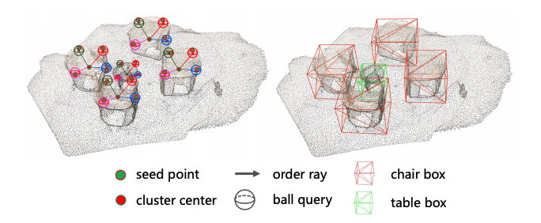

# RBGNet

This is the official implementation of paper:

#### RBGNet: Ray-based Grouping for 3D Object Detection
[PaperLink](https://arxiv.org/abs/2204.02251)



## NEWS
- [22-8-25] Official implementation based on [OpenPCDet](https://github.com/open-mmlab/OpenPCDet) is released.
- 🔥 RBGNet is accepted at CVPR 2022.


## Introduciton
This paper proposes the RBGNet framework, a voting-based 3D detector for accurate 3D object detection from point clouds. In order to learn better representations of object shape to enhance cluster features for predicting 3D boxes, we propose a ray-based feature grouping module, which aggregates the point-wise features on object surfaces using a group of determined rays uniformly emitted from cluster centers. Considering the fact that foreground points are more meaningful for box estimation, we design a novel foreground biased sampling strategy in downsample process to sample more points on object surfaces and further boost the detection performance.


## Installation
Our implementation is based on [OpenPCDet](https://github.com/open-mmlab/OpenPCDet), so just follow their [Installation](https://github.com/open-mmlab/OpenPCDet/blob/master/docs/INSTALL.md) and [Getting_Started](https://github.com/open-mmlab/OpenPCDet/blob/master/docs/GETTING_STARTED.md).

### Requirements
All the codes are tested in the following environment:
* Linux (tested on Ubuntu 14.04/16.04/18.04/20.04/21.04)
* Python 3.6+
* PyTorch 1.1 or higher (tested on PyTorch 1.1, 1,3, 1,5~1.10)
* CUDA 9.0 or higher (PyTorch 1.3+ needs CUDA 9.2+)

### Install `pcdet v0.5`
NOTE: Please re-install `pcdet v0.5` by running `python setup.py develop` even if you have already installed previous version.

a. Clone this repository.
```shell
git clone https://github.com/Haiyang-W/RBGNet.git
```

b. Install the dependent libraries as follows:

[comment]: <> (* Install the dependent python libraries: )

[comment]: <> (```)

[comment]: <> (pip install -r requirements.txt )

[comment]: <> (```)

* Install the SparseConv library, we use the implementation from [`[spconv]`](https://github.com/traveller59/spconv).
    * If you use PyTorch 1.1, then make sure you install the `spconv v1.0` with ([commit 8da6f96](https://github.com/traveller59/spconv/tree/8da6f967fb9a054d8870c3515b1b44eca2103634)) instead of the latest one.
    * If you use PyTorch 1.3+, then you need to install the `spconv v1.2`. As mentioned by the author of [`spconv`](https://github.com/traveller59/spconv), you need to use their docker if you use PyTorch 1.4+.
    * You could also install latest `spconv v2.x` with pip, see the official documents of [spconv](https://github.com/traveller59/spconv).

c. Install this `pcdet` library and its dependent libraries by running the following command:
```shell
python setup.py develop
```

## Data Preparation
We haven't achieved compatibility with the generated data of OpenPCDet yet and use the same data format as [mmdeteciton3d](https://github.com/open-mmlab/mmdetection3d) for now. We will try to implement indoor data pre-processing based on OpenPCDet as soon as possible.
### ScanNet V2
Please install [mmdeteciton3d](https://github.com/open-mmlab/mmdetection3d) first and follow the data preparation [ScanNet V2](https://github.com/open-mmlab/mmdetection3d/blob/master/data/scannet/README.md/). Then link the generated data as follows:
```shell
ln -s ${mmdet3d_scannet_dir} ./RBGNet/data/scannet
``` 
### SUN RGB-D
Please install [mmdeteciton3d](https://github.com/open-mmlab/mmdetection3d) first and follow the data preparation [Sun RGB-D](https://github.com/open-mmlab/mmdetection3d/blob/master/data/sunrgbd/README.md/). Then link the generated data as follows:
```shell
ln -s ${mmdet3d_sunrgbd_dir} ./RBGNet/data/sunrgbd
``` 

## Training and Tesing
All the models are trained and evalutation on 4 GPUs.
### ScanNet V2
#### Training with Eval
```shell
CUDA_VISIBLE_DEVICES=0,1,2,3 sh scripts/dist_train.sh 4 --cfg_file ./cfgs/scannet_models/RBGNet.yaml --ckpt_save_interval 1 --num_epochs_to_eval 15
```
#### Testing
Only support batch size = 1
```shell
CUDA_VISIBLE_DEVICES=0,1,2,3 sh scripts/dist_test.sh 4 --cfg_file ./cfgs/scannet_models/RBGNet.yaml --batch_size 4 --ckpt ../output/cfgs/scannet_models/RBGNet/default/ckpt/checkpoint_epoch_${epochid}.pth
```
### Sun RGB-D
#### Training with Eval
```shell
CUDA_VISIBLE_DEVICES=0,1,2,3 sh scripts/dist_train.sh 4 --cfg_file ./cfgs/sunrgbd_models/RBGNet.yaml --ckpt_save_interval 1 --num_epochs_to_eval 15
```
#### Testing
Only support batch size = 1
```shell
CUDA_VISIBLE_DEVICES=0,1,2,3 sh scripts/dist_test.sh 4 --cfg_file ./cfgs/sunrgbd_models/RBGNet.yaml --batch_size 4 --ckpt ../output/cfgs/sunrgbd_models/RBGNet/default/ckpt/checkpoint_epoch_${epochid}.pth
```

### Main Results
All models are trained with 4 3090 GPUs and the pretrained models will be released soon.

|   Dataset | mAP@0.25 | mAP0.50 | Pretrain Model (will soon) |
|----------|----------:|:-------:|:-------:|
| [ScanNet (Ray-66)](tools/cfgs/scannet_models/RBG.yaml) | 70.2(69.6)  |	54.2(53.6) | [model](https://github.com/Haiyang-W/RBGNet) |
| [Sun RGB-D (Ray-66)](tools/cfgs/scannet_models/RBG.yaml) | 64.1(63.6)   |	47.2(46.3) | [model](https://github.com/Haiyang-W/RBGNet) |


## Citation
Please consider citing our work as follows if it is helpful.
```
@inproceedings{wang2022rbgnet,
  title={RBGNet: Ray-based Grouping for 3D Object Detection},
  author={Wang, Haiyang and Shi, Shaoshuai and Yang, Ze and Fang, Rongyao and Qian, Qi and Li, Hongsheng and Schiele, Bernt and Wang, Liwei},
  booktitle={Proceedings of the IEEE/CVF Conference on Computer Vision and Pattern Recognition},
  pages={1110--1119},
  year={2022}
}
```

## Acknowledgments
This project is based on the following codebases.
* [OpenPCDet](https://github.com/open-mmlab/OpenPCDet)
* [VoteNet](https://github.com/facebookresearch/votenet)


